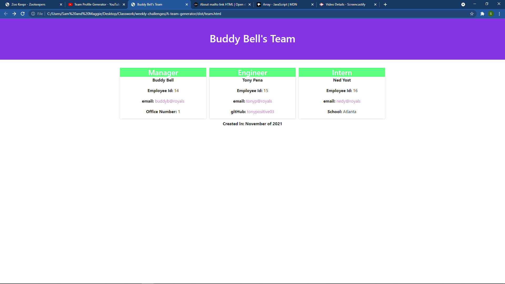

# A-team-generator   

## Table of Contents
* [Description](#description)
* [Installation](#installation)
* [Usage](#usage)
* [License](#license)
* [References](#reference)
* [Contributing](#contributing)
* [Tests](#tests)
* [Questions](#questions)

## Description 
_***Built With:***_ JavaScript,HTML,CSS,ES6,Bootstrap,Node  
This application will easily build an html page showing the details for a development team. It was built using Node.js. It is a bootcamp challenge. The code was written from scratch, but they did give some recommendations on what to include for each object class. It was more difficult to figure out the recursion of the prompts than I expected. I struggled with it for quite some time. Finally, I did a google search for help and found an excellent video of another student(Joelle DesChatelets). This video was very well done, and I was able to use her method of recursion for the prompts I had written. I also recieved some help from my bootcamp tutor(Corey Yates) with the final touches of writing the file using my html template. Overall, I am happy with the project. It brought together many of the skills I have been learning over the last 11 weeks of the bootcamp.

## Installation 
Clone the repo to your local computer. Navigate to the directory in your terminal. Enter 'npm init -y' in the command line. Also enter 'npm install inquirer'. 

## Usage 
Enter the command 'npm start' in the command line. Your html file will be generated in the /dist folder. An existing assets subfolder holds a style.css file which styles the generated html page.

[Demo Video](./images/demVideo.webm)

## License 
[MIT](https://opensource.org/licenses/MIT)

## References 
[Joelle DesChatelets](https://github.com/jdeschat), Corey Yates

## Contributing 
[Contributing Guidelines](./docs/contribute.txt)

## Tests 
N/A at this time

## Questions 
Contact: Sam Davenport  
https://github.com/steadysamwise4  
samueldavenport@att.net
    
